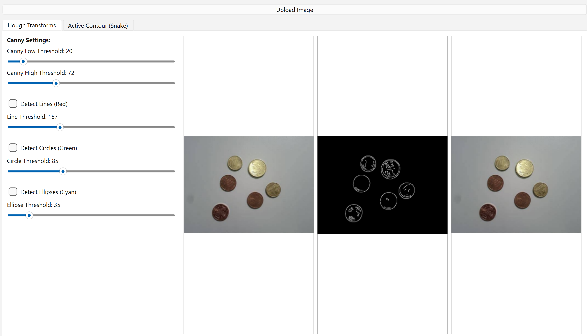
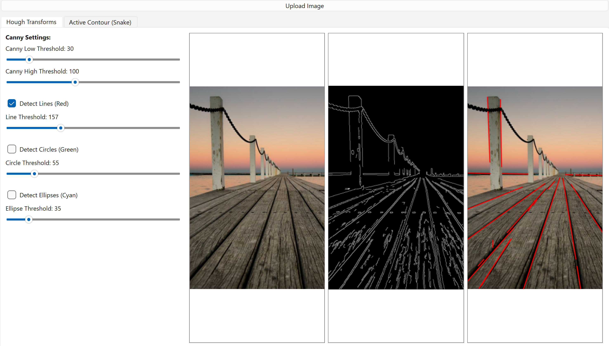
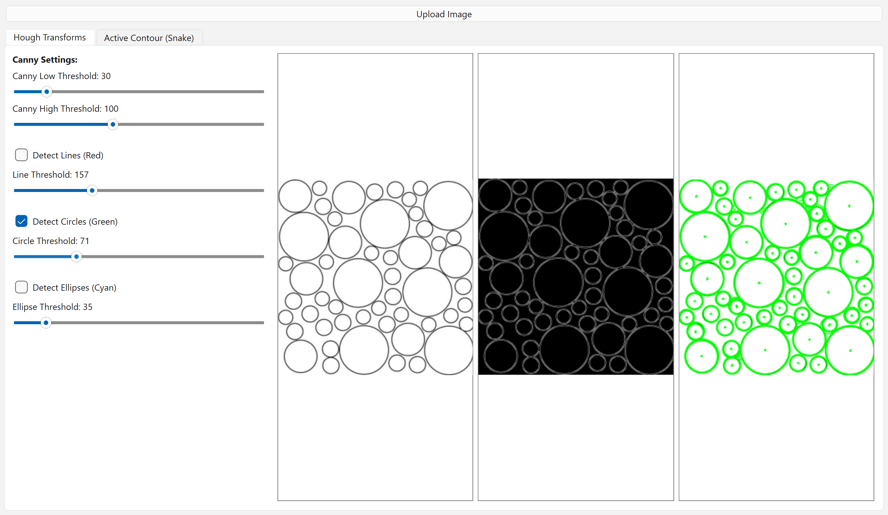
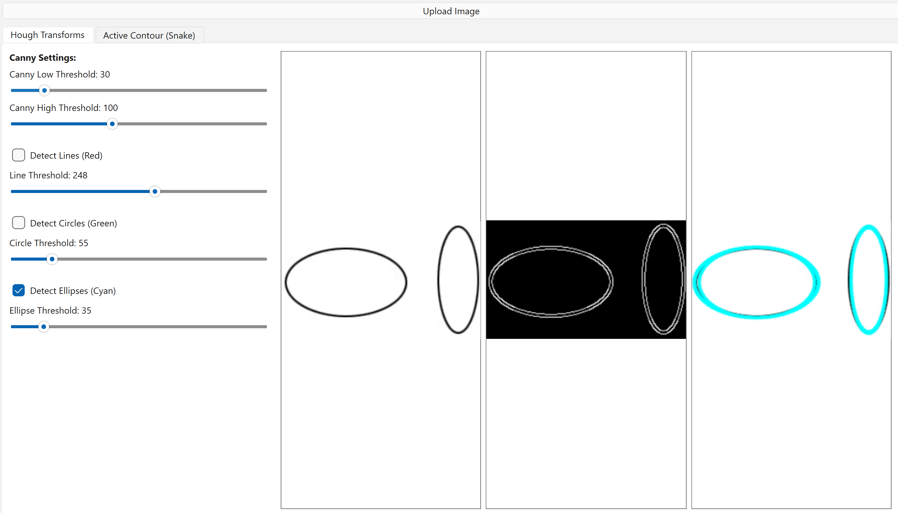
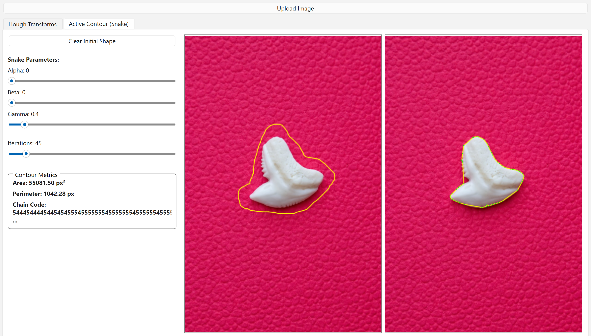

# 🖼️ Edges-and-Objects-Detection: Computer Vision Toolkit — Hough Transforms & Active Contour

A Qt/C++ desktop application implementing classic computer vision algorithms from scratch using OpenCV, featuring interactive edge detection, shape detection via Hough Transforms (lines, circles, ellipses), and Active Contour (Snake) segmentation.

---

## ✨ Features

### 🔷 Canny Edge Detection (Custom Implementation)
- Manual 5×5 Gaussian blur kernel
- Sobel gradient computation (magnitude + direction)
- Non-Maximum Suppression for edge thinning
- Double threshold + hysteresis for edge linking

### 🔶 Hough Transforms
| Shape | Color | Notes |
|-------|-------|-------|
| Lines | ❤️ Red | Probabilistic-style segment extraction with gap control |
| Circles | 💚 Green | 3D accumulator flattened to 1D for memory efficiency |
| Ellipses | 🩵 Cyan | Semi-axis sweep with Non-Maximum Suppression |

### 🐍 Active Contour (Snake)
- Freehand contour drawing directly on the image
- Iterative energy minimization (elasticity + smoothness + edge pull)
- Distance Transform-based image energy field
- Real-time contour metrics:
  - **Area** (px²)
  - **Perimeter** (px)
  - **Chain Code** (Freeman 8-direction)

---

## 🛠️ Tech Stack

- **Language:** C++17
- **GUI Framework:** Qt 5/6
- **Vision Library:** OpenCV 4.x
- **Build System:** qmake / CMake

---

## 🎮 Usage

1. **Open Image** — Click "Upload Image" to load a `.png` / `.jpg` file.
2. **Hough Tab** — Adjust Canny thresholds and shape-specific thresholds via sliders; toggle Lines / Circles / Ellipses detection with checkboxes.
3. **Snake Tab** — Click and drag on the image to draw an initial contour, then tune Alpha / Beta / Gamma / Iterations sliders to watch the snake converge.

---

## 📊 Results

### Canny Edge Detection
| Edges |
|-------|
|  |

---

### Hough Line Detection
| Detected Lines |
|----------------|
|  |

---

### Hough Circle Detection
|Detected Circles |
|-----------------|
|  |

---

### Hough Ellipse Detection
|Detected Ellipses |
|------------------|
| |

---

### Active Contour (Snake)
| Initial Contour |
|----------------|
| |

> 💡 To add your own screenshots, place them in a `results/` folder at the root of the repo and update the paths above accordingly.

---

## ⚙️ Parameters Guide

| Parameter | Effect | Recommended Range |
|-----------|--------|-------------------|
| Canny Low | Lower edge sensitivity | 20–80 |
| Canny High | Upper edge sensitivity | 80–200 |
| Line Threshold | Min votes for a line | 100–250 |
| Circle Threshold | Min votes for a circle | 60–150 |
| Ellipse Threshold | Min votes for an ellipse | 40–100 |
| Alpha (α) | Snake elasticity — keeps points evenly spaced | 0.5–2.0 |
| Beta (β) | Snake smoothness — resists sharp bends | 0.5–2.0 |
| Gamma (γ) | Edge attraction strength | 1.0–5.0 |
| Iterations | More = finer convergence, slower | 50–300 |

---

## 📁 Project Structure

```
├── ActiveContour.h / .cpp       # Snake energy minimization
├── CannyEdgeDetector.h / .cpp   # Custom Canny pipeline
├── HoughLineDetector.h / .cpp   # Line detection & drawing
├── HoughCircleDetector.h / .cpp # Circle detection (3D accumulator)
├── HoughEllipseDetector.h / .cpp# Ellipse detection
├── mainwindow.h / .cpp          # Qt GUI, event handling, display
└── results/                     # Screenshots (add yours here)
```

---

## 📄 License

This project is open-source. Feel free to use, modify, and distribute with attribution😊.
